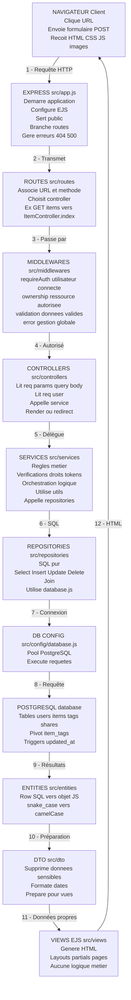

```mermaid
flowchart TD

A[NAVIGATEUR Client
Clique URL
Envoie formulaire POST
Recoit HTML CSS JS images]

B[EXPRESS src/app.js
Demarre application
Configure EJS
Sert public
Branche routes
Gere erreurs 404 500]

C[ROUTES src/routes
Associe URL et methode
Choisit controller
Ex GET items vers ItemController.index]

D[MIDDLEWARES src/middlewares
requireAuth utilisateur connecte
ownership ressource autorisee
validation donnees valides
error gestion globale]

E[CONTROLLERS src/controllers
Lit req params query body
Lit req user
Appelle service
Render ou redirect]

F[SERVICES src/services
Regles metier
Verifications droits tokens
Orchestration logique
Utilise utils
Appelle repositories]

G[REPOSITORIES src/repositories
SQL pur
Select Insert Update Delete
Join
Utilise database.js]

H[DB CONFIG src/config/database.js
Pool PostgreSQL
Execute requetes]

I[POSTGRESQL database
Tables users items tags shares
Pivot item_tags
Triggers updated_at]

J[ENTITIES src/entities
Row SQL vers objet JS
snake_case vers camelCase]

K[DTO src/dto
Supprime donnees sensibles
Formate dates
Prepare pour vues]

L[VIEWS EJS src/views
Genere HTML
Layouts partials pages
Aucune logique metier]

A -->|1 - Requête HTTP| B  
    B -->|2 - Transmet| C  
    C -->|3 - Passe par| D  
    D -->|4 - Autorisé| E  
    E -->|5 - Délègue| F  
    F -->|6 - SQL| G  
    G -->|7 - Connexion| H  
    H -->|8 - Requête| I  
    I -->|9 - Résultats| J  
    J -->|10 - Préparation| K  
    K -->|11 - Données propres| L  
    L -->|12 - HTML| A

```
#diagramme #schema 