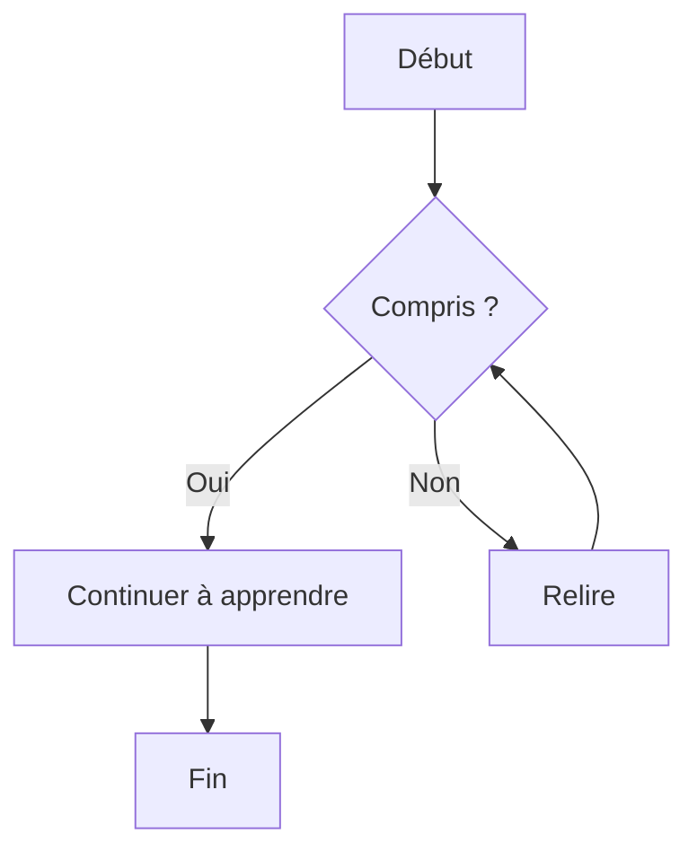

# Obsidian Documentation
## couleur de fond par bloc Obsidian

> [!info]
> Lorem ipsum dolor sit amet

> [!todo]
> Lorem ipsum dolor sit amet

> [!tip]
> Lorem ipsum dolor sit amet
Aliases: `hint`, `important`

> [!success]
> Lorem ipsum dolor sit amet
Aliases: `check`, `done`

> [!question]
> Lorem ipsum dolor sit amet
Aliases: `help`, `faq`

> [!warning]
> Lorem ipsum dolor sit amet
Aliases: `caution`, `attention`

> [!failure]
> Lorem ipsum dolor sit amet
> Aliases: `fail`, `missing`

> [!danger]
> Lorem ipsum dolor sit amet
Alias: `error`

> [!bug]
> Lorem ipsum dolor sit amet

> [!example]
> Lorem ipsum dolor sit amet

> [!quote]
> Lorem ipsum dolor sit amet
Alias: `cite`

# ## Tableaux

Créer des tableaux est l'une des extensions les plus courantes :

```
| Nom  | Âge | Profession |
|------|-----|-----------|
| Zhang | 25  | Ingénieur |
| Li    | 30  | Designer  |
```

| Nom   | Âge | Profession |
| ----- | --- | ---------- |
| Zhang | 25  | Ingénieur  |
| Li    | 30  | Designer   |

## Blocs de code délimités

Blocs de code avec coloration syntaxique :

```javascript
function hello() {
    console.log("Hello, World!");
}
```

```python
function hello() {
    console.log("Hello, World!");
}
```

## Listes de tâches

Créer des listes de choses à faire :

```
- [x] Finaliser le plan du projet
- [ ] Écrire le code
- [ ] Tester les fonctionnalités
- [ ] Déployer en ligne
```

- [x] Finaliser le plan du projet
- [ ] Écrire le code
- [ ] Tester les fonctionnalités
- [ ] Déployer en ligne

## Barré

Indiquer du contenu supprimé ou incorrect :

```
~~Ce texte est barré~~
```

~~Ce texte est barré~~

## Liens automatiques

Reconnaissance automatique des URLs et adresses email :

```
Visitez https://markdown.com.cn pour plus d'informations.
Contact : example@domain.com
```

Visitez [https://markdown.com.cn](https://markdown.com.cn/) pour plus d'informations. Contact : [example@domain.com](mailto:example@domain.com)

## Notes de bas de page

Ajouter des notes et références à votre document :

```
Voici un exemple de note de bas de page[^1].

[^1]: Ceci est le contenu de la note.
```

Voici un exemple de note de bas de page[^1].

[^1]: Ceci est le contenu de la note.

## Listes de définitions

Créer des listes de termes et définitions :

```
Markdown
:   Un langage de balisage léger

HTML
:   HyperText Markup Language
:   Le langage standard pour créer des pages web
```

## Formules mathématiques

Prise en charge des formules LaTeX :

```
Formule en ligne : $E = mc^2$

Formule bloc :
$$
\sum_{i=1}^n a_i = 0
$$
```

## Graphiques et diagrammes

Certains éditeurs avancés supportent les diagrammes Mermaid :

````

````